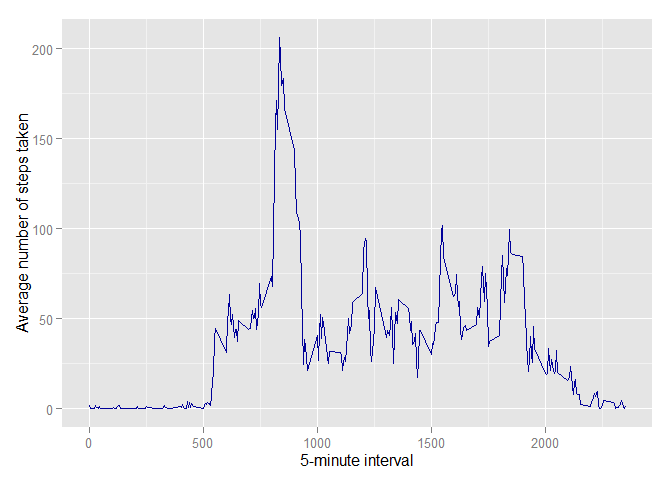

# Reproducible Research: Peer Assessment 1

## Global Settings
Below are the global settings used for the code 

```r
library(knitr)
library(ggplot2)
opts_chunk$set(echo=TRUE,results="show")
```

## Loading and preprocessing the data
Please make sure you have the 'activity.zip' file in the current directory

```r
unzip('activity.zip')
AssignData <- read.csv('activity.csv')
head(AssignData)
```

```
##   steps       date interval
## 1    NA 2012-10-01        0
## 2    NA 2012-10-01        5
## 3    NA 2012-10-01       10
## 4    NA 2012-10-01       15
## 5    NA 2012-10-01       20
## 6    NA 2012-10-01       25
```

## What is mean total number of steps taken per day?
This section is to find the total number of steps taken per day and also to find the mean and median

```r
TotalSteps <- tapply(AssignData$steps, AssignData$date, sum, na.rm=TRUE)
qplot(TotalSteps,
      geom="histogram",
      binwidth = 500,  
      main = "Total Steps per Day", 
      xlab = "Total Steps",  
      fill=I("blue"), 
      col=I("red"))
```

 

```r
totalmean <- mean(TotalSteps, na.rm=TRUE)
totalmedian <- median(TotalSteps, na.rm=TRUE)
```
The mean and median of the total number of steps taken per day are 9354.2295082 and 10395

## What is the average daily activity pattern?
In this part, a time series plot for 5 minute interval will be plotted and the max number of steps in a particular time will be estaimated

```r
AvgDaily <- aggregate(x=list(steps=AssignData$steps), 
                      by=list(interval=AssignData$interval),
                      FUN=mean, na.rm=TRUE)
ggplot(data=AvgDaily, aes(x=interval, y=steps)) +
    geom_line(colour="#000099") +
    xlab("5-minute interval") +
    ylab("Average number of steps taken")
```

 

```r
MaxStepsIndex <- which.max(AvgDaily$steps)
MaxAvgDaily <- AvgDaily[MaxStepsIndex,1]
```
The maximum number of steps on average across all the days for the 5-minute interval was at 835 

## Imputing missing values
In this section, missing values will be found and will be replaced by the mean of that day. New Data is created by replacing the NA with the mean.   

```r
NAIndex <- is.na(AssignData$steps)
Missing <- as.data.frame(table(NAIndex))
MissingCount<- Missing[2,2]
AvgDaily <- aggregate(x=list(steps=AssignData$steps), 
                      by=list(interval=AssignData$interval),
                      FUN=mean, na.rm=TRUE)
n = nrow(AssignData)
NewData <- AssignData
for(i in 1:n)
{
  if (is.na(NewData$steps[i])==TRUE){
      indexfind <- which(AvgDaily$interval == NewData$interval[i])
      NewData$steps[i]=AvgDaily$steps[indexfind]
  }
       
}

NewTotalSteps <- tapply(NewData$steps, NewData$date, sum)
qplot(NewTotalSteps,
      geom="histogram",
      binwidth = 500,  
      main = "Total Steps per Day", 
      xlab = "Total Steps",  
      fill=I("blue"), 
      col=I("red"))
```

 

```r
Newtotalmean <- mean(NewTotalSteps)
Newtotalmedian <- median(NewTotalSteps)
```
The total number of rows with NA's is 2304. The mean and median of the total number of steps taken per day are 1.0766189\times 10^{4} and 1.0766189\times 10^{4}.Based on the New Data,the mean seems to be decreased compared to the data which was having NA's and median became equal to mean. 

## Are there differences in activity patterns between weekdays and weekends?
This section is to find the date falls in weekday or weekend to find the activity patterns between those two. 


```r
NewData$date <- as.Date(NewData$date)
FindDay <- function(date) {
    day <- weekdays(date)
    if (day %in% c("Monday", "Tuesday", "Wednesday", "Thursday", "Friday"))
        return("weekday")
    else if (day %in% c("Saturday", "Sunday"))
        return("weekend")
    else
        stop("invalid date")
}
NewData$day <- sapply(NewData$date, FUN=FindDay)
averages <- aggregate(steps ~ interval + day, data=NewData, mean)
ggplot(averages, aes(interval, steps)) + geom_line(color="#D55E00") + facet_grid(day ~ .) +
    xlab("5-minute interval") + ylab("Number of steps")
```

 

The result shows that there is slightly different pattern for the weekday or Weekend. 
